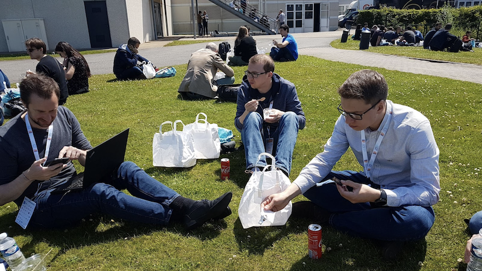

Cette année, nous avons participé à la troisième édition du Devfest de Lille qui a eu lieu le 14 juin, une journée de conférences, de quickies et d'échanges sur les sujets autour du Web, Mobile, Cloud, et de leur utilisation par les acteurs locaux.. C’est un événement annuelle organisé par le GDG Lille (Google Developer Group)

Pour cette saison 3, nous avons été convié dans le troisième plus grand cinéma du monde et le plus grand d’Europe: le Kinepolis de Lomme. 

Après une keynote sur les séries tv présentée par le membre de salto (le netflix français) Pierre Ziemniak, direction la conférences de Julien Debon sur les tests de propriétés “Ecrivez moins de tests, trouvez plus de bugs”. J’ai pu redecouvrir la librairie quickcheck avec de nouveau exemple. Cette librairie permet en autre d'éviter de mettre “toto” ou “tata” dans ses tests unitaire en démultipliant le nombre de tests.

Direction la conférence de Sébastien Nahelou sur “Kubernetes: Pimp my laptop”. Une conf un peu décevant car nous y voyons beaucoup d’outils mais rien n’est vraiment approfondi.

Séb : Pour ma part j’ai commencé par une conf très intéressante de “François Teychene“ de (SAAGIE) sur “Des microservices aux migroservices” relatant les dangers de la migration de son monolithique en micro-service. La phrase à retenir “ce n’est pas en faisant des parts de lasagne qu’on fait des raviolis”.  Ensuite direction “Flutter : comment fonctionne les widgets ?” par “Edouard Marquez” (Freelance) avec une bonne explication des différentes arborescence des widgets.

On attaque ensuite le moment le plus important de la journée, la pause déjeuner. On se retrouve avec plusieurs membre de Davidson autour d’un sandwich à la dinde et une part de cheese cake.

  

On enchaîne à 13h sur “Comment perdre sa surcharge featurale ?” où Estelle Landry de la société Elium nous explique comment alléger les fonctionnalités d’une application pour la rendre plus attractive.
Petit passage sur “Il faut sauver le soldat Jenkins!” où Nicolas De Loof de CloudBees nous fait découvrir Jenkins X. Pour ma part ce fut une réel découverte et si vous avez 5 minutes aujourd’hui aller découvrir Jenkins X.

Pour finir la journée, on enchaîne quelque quickies sur Micronaute (ou comment alléger la JVM), sur du GCP et enfin sur les containers de test pour elasticSearch.

Séb: 13h Direction programmation réactive “Doom, gloom or loom” de “Rémi Forax” qui pour moi à été interrompue par un petit incident de prod  (Youpi ! :-/). Ensuite on continue par une conf sur “Cypress” de “Rodolph BUNG” (EGENCIA) outil de test end-to-end qui a l’air simple d’utilisation, GO to test it ! 

Puis on finit la journée par des petites conf : Amélioration de l’accessibilité de votre site web, une conf qui donne envie de tester plein de choses avec Google Cloud IoT core et des microcontrôleur, puis une autre sur WebAuth

Voilà un rapide résumé de notre journée bien rempli de conférences et d’échanges avec quelques experts, le tout intercalé par de petits passage sur les stands ou l’on pouvez, par exemple se faire tirer le portrait ;p

  

