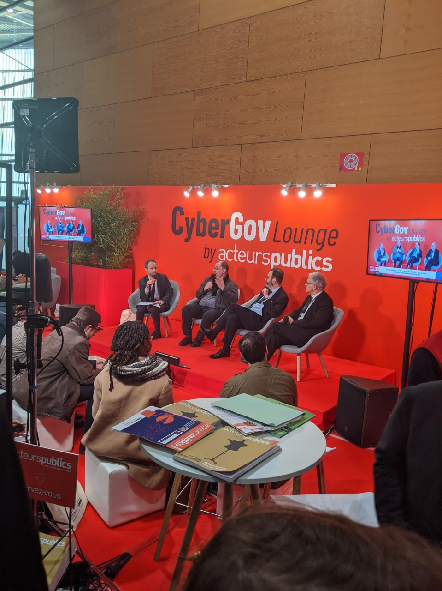
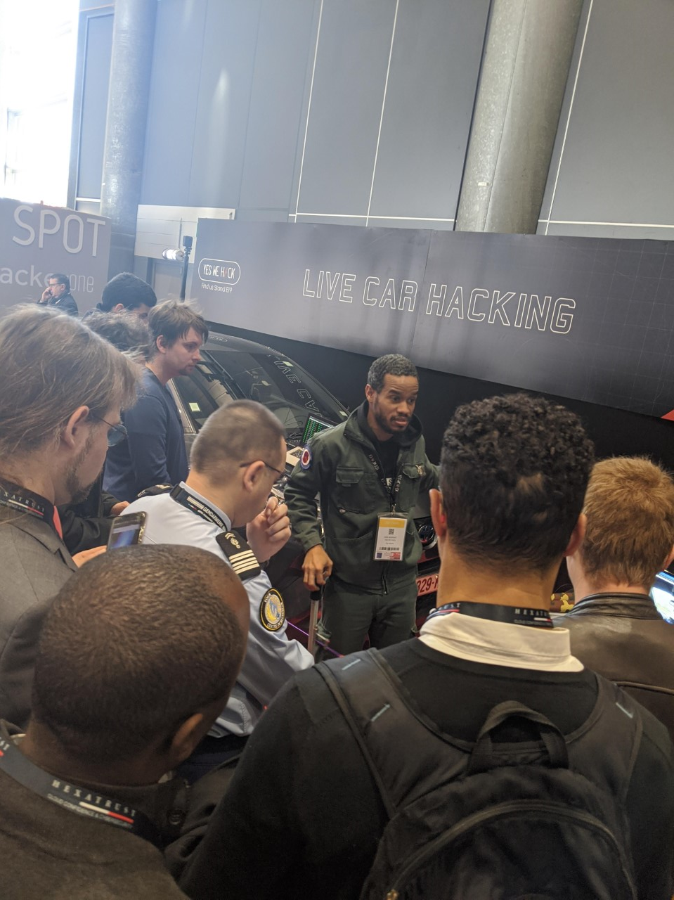

Le Forum International de la Cybersécurité (FIC) a eu lieu à Lille Grand Palais durant trois jours (le 28, 29 et 30 janvier 2020) et s'est imposé comme l'événement de référence en Europe en matière de sécurité et de confiance numérique.

### **Hicham (Ingénieur Système chez Décathlon)**: 

« Lors de ma visite du FIC 2020, j'ai eu la chance d'échanger avec plusieurs sociétés spécialisées dans la sécurité de l'information. 
J'ai commencé ma journée par un entretien avec un agent cybersécurité de la police nationale qui m'a informé que les trois risques majeurs encourus en matière de cybersécurité sont : Le Ransomware, Le déni de service et la fraude bancaire. J'ai appris aussi que les attaques sont principalement en provenance de la Russie, des Etats-Unis et de l’Asie. 
J'ai enchaîné ensuite par les entreprises spécialisées dans la sécurité des Emails notamment Vade Secure et Securemail qui proposent des services de filtrage mails en se basant sur plusieurs critères comme la réputation de l'IP Sender, les mots clés (keywords) et le scoring mails. 
J’ai eu l’occasion de faire un tour des stands (**Gendarmerie nationale**, **Imprimerie Nationale**, **Dataprotect**, **SSL 247**, **Live hacking car**...), ce qui m'a permis d'échanger avec ces entreprises, de les connaître et de garder contact avec celles qui m'intéressent. 
Finalement, Le FIC est un événement très spécial que je recommande pour ceux qui souhaitent rester à jour sur les technologies de sécurité et élargir leur réseau professionnel. » 

### **Thibaud (Ingénieur d'affaires Infra Réseau)** : 

« Les Lillois sont chanceux d'avoir un tel évènement organisé à Lille, l'édition du FIC 2020 a rassemblé plus de 12 000 participants sur 3 jours (ministres, décideurs, chefs d'entreprises, RSSI, étudiants). Davidson Paris et Lille étaient présents ! 
Retour sur mon parcours : 
- Conférences techniques organisées par le groupe Defcon Lillois, vous pouvez suivre les prochains événements sur Lille [ici](http://www.dc3303.org)  
- Rencontre avec Gael Musquet spécialisé dans la sécurité des voitures connectées (son [twitter](https://twitter.com/RatZillaS?s=20))  
- Rencontre avec [HS2](https://www.hs2.fr/) (Formation sécurité)  
- Rencontre avec [Tranquil IT](https://www.tranquil.it) (Déploiement automatisé)  
- Rencontre avec [GitGuardian](https://www.gitguardian.com/), détection de secret dans GitHub  
- Networking avec plusieurs acteurs Thalès, SFR, Stormshield etc. 
- [Conférence de DarkTrace](https://www.darktrace.com/fr/) DarkTrace, L'IA dans la cybersécurité
- [Conférence de Carrefour] Carrefour a expliqué leur stratégie de sécurité en partenariat avec GCP (Google Cloud Plateform). 
Google a présenté le déploiement de ses propres liens réseaux intercontinentaux. 
Le prochain évènement majeur en cybersécurité se déroulera le 26 & 27 juin à Paris, il s'agit de "LE HACK" (anciennement "La Nuit du Hack"), [plus d'information ici](https://lehack.org/fr) »

### **Maxime (Ingénieur QA chez StormShield)** : 

« Je suis allé à l’édition du FIC 2020 pour la première fois car mon client actuel est un acteur majeur de la cybersécurité. J’ai ainsi pu aller discuter directement avec des entreprises avec qui nous travaillons au quotidien. J’ai également pu échanger avec des clients afin d’avoir un angle de vue autre que celui du labo R&D dans lequel je suis en poste. 
Enfin j’ai assisté à une table ronde très intéressante concernant le devenir de normes européennes en matière de cybersécurité. »

  

  

